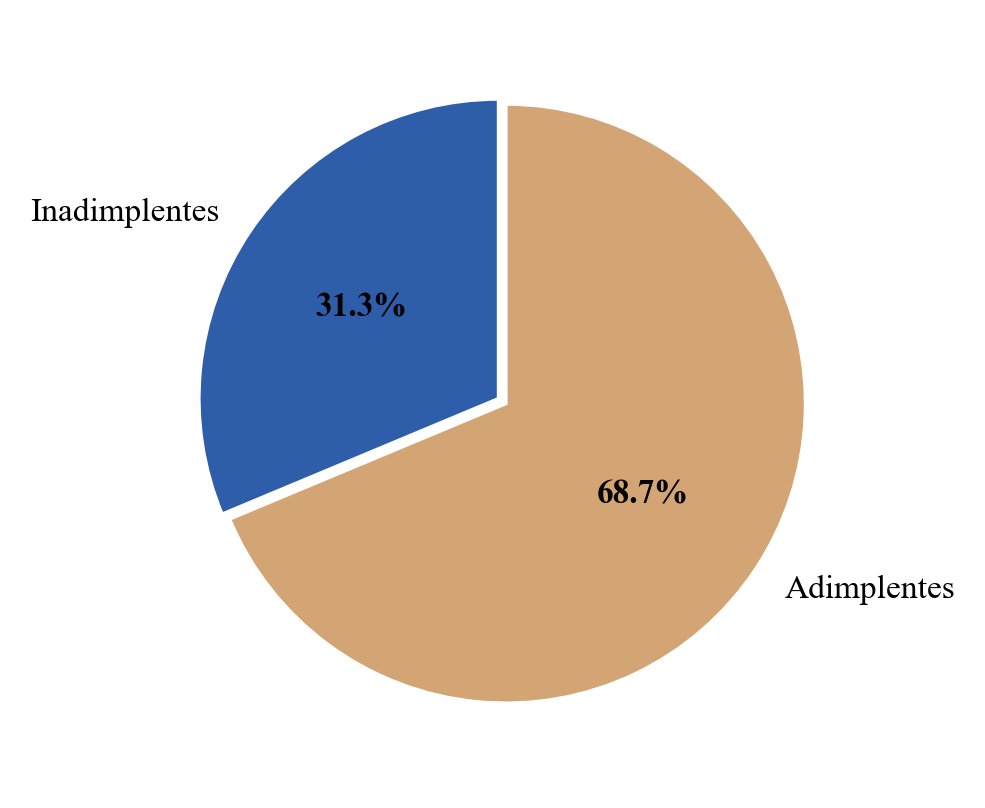
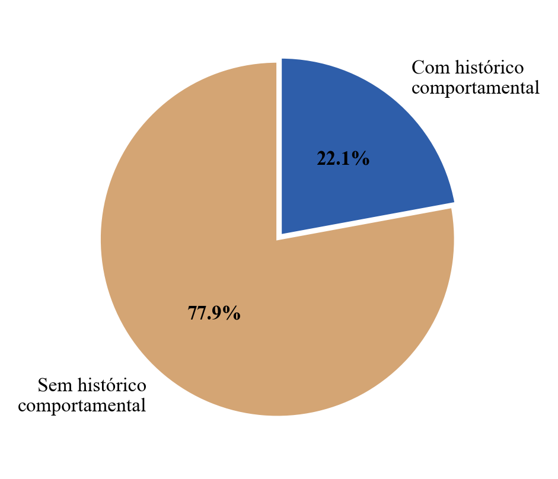
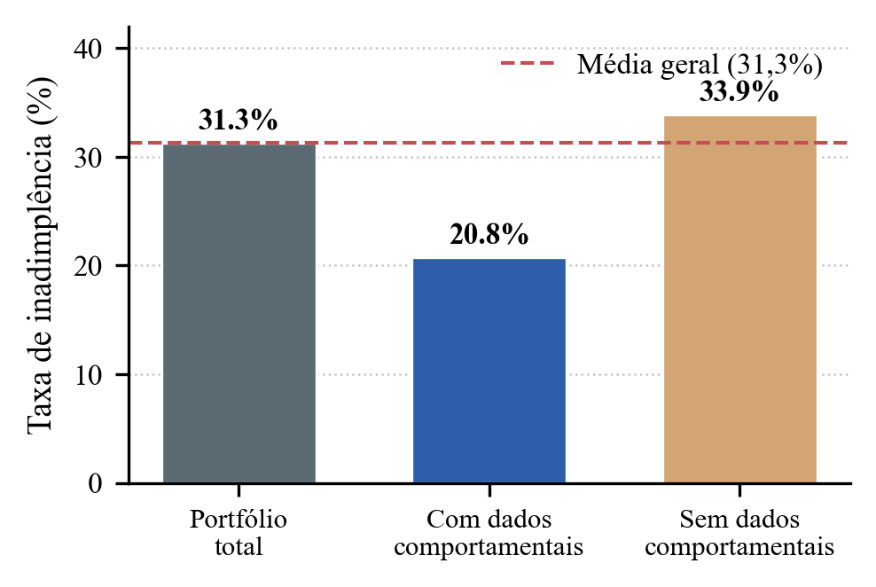

# **SISTEMA HÍBRIDO DE CREDIT SCORING PARA PEQUENOS VAREJISTAS UTILIZANDO MACHINE LEARNING: UM ESTUDO DE CASO NA PRASO**

## **Abstract**

A concessão de crédito para pequenos varejistas representa um desafio devido à escassez de informações financeiras estruturadas e ao risco de inadimplência. A Praso, startup brasileira especializada em distribuição para pequenos estabelecimentos comerciais, utiliza um sistema de análise de crédito baseado em dados cadastrais, informações de bureaus de crédito e dados comportamentais dos clientes. Este trabalho propõe a construção de modelos de Machine Learning para previsão de inadimplência utilizando dados de aproximadamente 3.000 clientes, complementados por um sistema híbrido de roteamento que direciona cada cliente ao modelo mais adequado (comportamental, de aplicação ou revisão manual). Foram realizadas etapas de análise exploratória, pré-processamento, engenharia de atributos e treinamento de modelos supervisionados com otimização de hiperparâmetros. O modelo comportamental final utiliza 18 features derivadas do histórico transacional. Os resultados demonstram que a utilização combinada de dados cadastrais e comportamentais, mediada por um router baseado em regras, permite melhorar significativamente a capacidade de identificação de clientes de risco, alcançando ROC-AUC de **0,850** no sistema integrado (ganho de +4,56 pontos percentuais sobre o baseline de aplicação isolado, AUC 0,804).

## **I. INTRODUÇÃO**

O acesso ao crédito é um dos principais fatores que influenciam a sustentabilidade financeira de pequenos varejistas. Entretanto, a concessão de crédito envolve riscos associados à possibilidade de inadimplência dos clientes, exigindo mecanismos eficientes de avaliação de risco.

A Praso atua no segmento de distribuição para pequenos estabelecimentos comerciais e oferece crédito para seus clientes realizarem compras por meio da plataforma. Para isso, utiliza informações públicas, dados de crédito e histórico de relacionamento para estimar a probabilidade de inadimplência de cada cliente.

Uma das principais dores do pequeno varejista é o **ciclo de caixa** — o tempo médio que a empresa leva para transformar gastos em receita. O ciclo é calculado como (PME + PMR) − PMP, em que PME é o prazo médio de estocagem, PMR o prazo médio de recebimento e PMP o prazo médio de pagamento. Quanto menor o ciclo, melhor para a saúde financeira do negócio. No mercado tradicional, fornecedores levam de 2 a 14 dias para avaliar o crédito de um varejista antes de conceder prazo de pagamento, o que mantém o caixa preso por mais tempo. A Praso se diferencia ao oferecer **análise de crédito instantânea no momento do cadastro** no aplicativo, eliminando essa espera e desburocratizando o acesso ao crédito para pequenos empreendedores.

A utilização de técnicas de Machine Learning permite automatizar esse processo, reduzindo o tempo de análise, aumentando a escalabilidade e melhorando a qualidade das decisões de crédito.

O objetivo deste trabalho é desenvolver e avaliar modelos de classificação capazes de prever a probabilidade de inadimplência de clientes da plataforma Praso, utilizando tanto informações cadastrais quanto dados comportamentais oriundos do histórico de pedidos, integrados por um sistema de roteamento em três tiers.

## **II. ANÁLISE DE DADOS E FEATURE ENGINEERING**

### **A. Análise Exploratória dos Dados**

O conjunto de dados disponibilizado pela Praso é composto por duas bases principais: uma base de clientes contendo informações cadastrais e uma base de pedidos contendo informações transacionais.

A base de clientes possui 3.000 registros e inclui variáveis como unidade federativa, município, segmento do cliente, natureza jurídica, fonte de aquisição, CNAE, capital social, idade do CNPJ, indicadores da Serasa, presença no iFood e informações do Google Maps. A variável alvo é `inadimplente`, que indica se o cliente apresentou ou não histórico de inadimplência. Foi verificada a unicidade dos identificadores de cliente (`id_cliente`), sem duplicatas encontradas.

A base de pedidos contém informações transacionais, como identificador do pedido, identificador do cliente, valor do pedido, atraso no pagamento e data de entrega. Essa base permite construir variáveis comportamentais por cliente. A verificação de duplicidades em `id_pedido` também não identificou registros repetidos.

#### **1\) Análise Exploratória Estrutural**

As variáveis da base foram classificadas em categóricas, numéricas, binárias e temporais.

As principais variáveis categóricas são: `uf`, `municipio`, `segmento_cliente`, `natureza_juridica`, `fonte_cliente`, `cnae_codigo`, `ifood_faixa_preco` e `serasa_credores`. Embora o CNAE contenha números, ele deve ser tratado como variável categórica hierárquica, pois seus valores representam atividades econômicas e não quantidades.

As principais variáveis numéricas são: `capital_social`, `idade_cnpj`, `serasa_contagem_negativacoes`, `serasa_contagem_protestos`, `ifood_contagem_avaliacoes`, `google_maps_avaliacao`, `google_maps_contagem_avaliacoes`, `valor` e `atraso`.

As variáveis binárias incluem `serasa_socio_tem_negativacao`, `google_maps_tem_website` e `inadimplente`.

A variável temporal principal é `data_entrega`, presente na base de pedidos.

A análise da variável alvo mostrou que **31,3%** dos clientes possuem histórico de inadimplência, enquanto **68,7%** são adimplentes. Essa distribuição indica um desbalanceamento moderado entre as classes, comum em problemas de credit scoring.

Nesse cenário, a acurácia isolada pode ser enganosa: um modelo que previsse sempre "adimplente" alcançaria ~68,7% de acurácia sem discriminar risco. Por isso, adotamos **AUC-ROC**, **F1** e **estratificação** na divisão dos dados como resposta ao desbalanceamento, priorizando métricas que avaliam a capacidade de separação entre classes minoritária e majoritária.

Outro ponto importante é a disponibilidade limitada de dados comportamentais. Apenas **664 clientes (22,1%)** possuem histórico de pedidos, enquanto **2.336 clientes (77,9%)** não possuem esse tipo de informação. Entre os clientes com pedidos, a taxa de inadimplência foi de **20,8%**, inferior à média geral da carteira.

 Essa característica justifica a construção de dois modelos distintos: um modelo de aplicação para clientes novos e um modelo comportamental para clientes recorrentes.

#### **2\) Análise de Valores Faltantes e Outliers**

Foram identificados valores faltantes principalmente em variáveis relacionadas ao iFood e ao Google Maps. Entretanto, nesses casos, a ausência de valor não necessariamente representa erro de coleta. Em muitos casos, o valor nulo indica que o estabelecimento não foi encontrado na respectiva plataforma.

Por esse motivo, em vez de remover essas observações, foram criadas variáveis indicadoras de presença ou ausência da informação. Por exemplo, a ausência de avaliações no iFood pode indicar que o cliente não atua fortemente em canais digitais, o que pode ser uma informação relevante para o modelo.

Também foram avaliados possíveis outliers em variáveis como `capital_social`, `serasa_contagem_negativacoes`, `serasa_contagem_protestos`, `google_maps_contagem_avaliacoes`, `valor` e `atraso`. Em problemas de crédito, outliers podem representar tanto erros quanto casos reais de alto risco. Foram identificados valores extremos em `serasa_contagem_negativacoes` (máximo = 141) e `serasa_contagem_protestos` (máximo = 79), mantidos no conjunto de treino por representarem clientes de alto risco real.

#### **3\) Análise Univariada**

A análise univariada investigou a relação individual entre cada atributo e a variável alvo.

A variável `idade_cnpj` apresentou relação relevante com inadimplência. Empresas mais antigas tendem a apresentar menor risco, possivelmente por possuírem maior estabilidade operacional e histórico de permanência no mercado.

Os indicadores da Serasa também se mostraram relevantes. Clientes com maior quantidade de negativações e protestos tendem a apresentar maior taxa de inadimplência. A variável `serasa_socio_tem_negativacao` também é importante, pois a existência de negativação associada aos sócios pode indicar risco adicional.

Variáveis de presença digital, como avaliações no Google Maps e iFood, podem atuar como proxies da maturidade comercial do estabelecimento. Negócios com presença digital estruturada podem apresentar perfil diferente daqueles sem registros nessas plataformas.

#### **4\) Análise Bivariada**

A análise bivariada buscou identificar relações entre pares de variáveis e sua associação com a inadimplência. Foram analisadas correlações entre variáveis numéricas relevantes (idade do CNPJ, capital social, negativações e protestos Serasa). Observou-se correlação positiva entre volume de negativações e inadimplência, enquanto idade do CNPJ correlaciona negativamente com o risco. Variáveis de presença digital (`has_ifood`, `has_google_maps`) apresentam correlação negativa fraca com inadimplência.

A análise bivariada confirmou os seguintes padrões (visualizados nos gráficos gerados no notebook de EDA):

1. **Idade do CNPJ:** empresas mais antigas apresentam menor taxa de inadimplência. Observou-se tendência clara de redução de risco em estabelecimentos com mais de **2.400 dias** (~6,5 anos) de operação.
2. **Negativação de sócios (`serasa_socio_tem_negativacao`):** clientes com sócios negativados apresentam risco significativamente superior à média da carteira.
3. **Protestos (`serasa_contagem_protestos`):** maior quantidade de protestos associa-se a maior taxa de inadimplência. A distribuição é fortemente assimétrica (mediana = 0; máximo = 79).
4. **Presença digital:** clientes presentes no iFood (6,2% da base) e no Google Maps (1,1%) tendem a apresentar menor inadimplência, sugerindo maior maturidade operacional.
5. **Indicadores Serasa:** negativações e protestos mostram forte diferenciação de risco entre grupos.

Essa etapa é importante porque algumas variáveis podem ter efeito mais forte quando combinadas. Por exemplo, uma empresa jovem com muitos credores pode apresentar risco superior ao de uma empresa jovem sem credores ou de uma empresa antiga com histórico controlado.

#### **5\) Análise Multivariada**

A análise multivariada foi utilizada para observar padrões conjuntos entre grupos de variáveis. Foram avaliados grupos de clientes com e sem histórico comportamental, clientes com e sem negativação, e clientes segmentados por atividade econômica.

Essa análise indicou que clientes com dados comportamentais apresentam uma taxa de inadimplência menor que a média geral da carteira. Enquanto a taxa geral de inadimplência é de 31,3%, os clientes com histórico comportamental apresentam taxa de 20,8%. Já os clientes sem histórico comportamental apresentam taxa de 33,9%. Esse resultado reforça a importância do histórico de pedidos para avaliação de risco.

### **B. Pré-processamento dos Dados**

#### **1\) Tratamento de Valores Faltantes**

Os valores faltantes foram tratados de acordo com seu significado. Atributos relacionados ao iFood e Google Maps apresentaram grande quantidade de valores nulos (87,9% a 98,9%). Entretanto, esses valores possuem significado de negócio: indicam que o estabelecimento não está presente na plataforma correspondente, e não representam erro de coleta. Para preservar essa informação, foram criadas variáveis binárias (`has_ifood`, `has_google_maps`) indicando a existência ou ausência do dado original, sem imputação cega dos valores ausentes.

Para demais colunas numéricas com missing esporádico, adotou-se imputação pela mediana no pipeline de modelagem. Colunas com 100% de valores nulos após engenharia de features (`ifood_contagem_avaliacoes`, `google_maps_contagem_avaliacoes`) foram excluídas do modelo final.

Essa estratégia preserva informação relevante e evita a perda de registros, o que é importante em uma base de tamanho moderado.

#### **2\) Tratamento de Outliers**

Os outliers foram identificados por análise estatística e visual, utilizando estatísticas descritivas e gráficos como boxplots. Em vez de remover automaticamente os valores extremos, adotou-se uma estratégia conservadora: outliers cadastrais e de crédito foram mantidos no conjunto de treino, pois representam casos reais de alto risco e os modelos baseados em árvores (Random Forest, XGBoost) são robustos a valores extremos.

Para features comportamentais derivadas do valor dos pedidos, aplicou-se transformação logarítmica (`log1p`) sobre as estatísticas agregadas por cliente (`log_valor_mean`, `log_valor_max`, `log_valor_min`, `log_valor_median`, `log_valor_std`), reduzindo a assimetria causada por pedidos de valor muito elevado.

#### **3\) Detecção e Tratamento de Duplicadas**

A verificação de duplicidades foi realizada com base em `id_cliente` na base de clientes e `id_pedido` na base de pedidos. Não foram encontradas duplicatas em nenhuma das duas chaves (0 registros duplicados em cada caso), indicando maior consistência estrutural da base.

#### **4\) Feature Scaling**

A normalização dos dados foi aplicada principalmente para modelos sensíveis à escala, como Regressão Logística. Para esse caso, o `StandardScaler` é adequado, pois transforma os atributos para média zero e desvio padrão igual a um.

Modelos baseados em árvores, como Random Forest e XGBoost, não exigem escalonamento obrigatório, pois realizam divisões baseadas em limiares das variáveis.

#### **5\) Encoding de Variáveis Categóricas**

As variáveis categóricas foram tratadas conforme sua natureza, utilizando One-Hot Encoding no pipeline de modelagem.

Na etapa de engenharia de atributos, `segmento_cliente`, `natureza_juridica` e `fonte_cliente` foram codificadas com `pd.get_dummies`. A variável `uf` possui apenas um valor distinto na base e, portanto, não gera colunas adicionais após o encoding.

No pipeline final dos modelos, as categorias remanescentes — `ifood_faixa_preco` e `cnae_divisao` — também foram tratadas com One-Hot Encoding (`OneHotEncoder`, ignorando categorias não vistas no treino).

Para o **CNAE**, o código hierárquico foi decomposto extraindo a **divisão** (dois primeiros dígitos, ex.: `56.11-2-04` → divisão `56`), utilizada como variável categórica nominal com baixa cardinalidade (39 divisões distintas) no lugar do código completo. Níveis adicionais (grupo e classe) e Target Encoding não foram aplicados nesta versão do pipeline.

### **C. Divisão dos Dados**

Os dados foram divididos em conjuntos de treino e teste utilizando amostragem estratificada para preservar a proporção de inadimplentes e adimplentes em cada subconjunto.

A divisão adotada foi de **70% para treino e 30% para teste** (`test_size=0.30`, estratificado). No Modelo de Aplicação, isso corresponde a 2.100 registros de treino e 900 de teste; no Modelo Comportamental, a 464 linhas de treino e 200 de teste.

A escolha de hiperparâmetros foi realizada via **RandomizedSearchCV** com validação cruzada estratificada de **3 folds** sobre o conjunto de treino, utilizando ROC-AUC como métrica de otimização (15 iterações por modelo no Modelo de Aplicação; 20 iterações no Modelo Comportamental). O conjunto de teste foi reservado exclusivamente para avaliação final, reduzindo o risco de overfitting e permitindo uma estimativa mais confiável do desempenho em dados não vistos.

### **D. Feature Engineering**

A etapa de engenharia de atributos foi central para melhorar a representação dos dados.

Primeiramente, variáveis representadas por intervalos foram convertidas para seus pontos médios. Por exemplo, uma faixa como `(1000,1500]` foi transformada no valor 1250. As colunas `capital_social`, `idade_cnpj` e `google_maps_avaliacao` geraram, respectivamente, `capital_social_mid`, `idade_cnpj_mid` e `google_maps_avaliacao_mid`. Essa transformação permite que modelos utilizem a variável como contínua.

Para o CNAE, foi extraída a divisão econômica (dois primeiros dígitos do código), permitindo capturar padrões de inadimplência associados a setores econômicos sem depender do código completo, que possui alta cardinalidade.

A coluna `serasa_credores`, originalmente representada como lista de até 5 setores separados por vírgula, foi transformada em `serasa_n_setores`, contagem de setores distintos entre os credores (0 quando o cliente não possui dívidas registradas). Também foi criada a flag `has_serasa_negativacao` para indicar presença de negativações.

Para o modelo comportamental, os pedidos foram agregados por cliente. O modelo final utiliza **18 features** derivadas do histórico de pedidos:

**Métricas de valor:** `valor_min`, `valor_max`, `valor_mean`, `valor_median`, `valor_std`

**Métricas de atraso:** `delay_mean`, `delay_max`, `pct_orders_delayed`, `has_any_delay`, `delay_spike_ratio` (razão entre atraso máximo e médio, capturando picos de atraso pontuais)

**Métricas de frequência e recência:** `orders_count`, `recency_days`, `orders_per_month`

**Features log-transformadas:** `log_valor_mean`, `log_valor_max`, `log_valor_min`, `log_valor_median`, `log_valor_std`

Essas variáveis permitem capturar o comportamento de pagamento do cliente, sendo especialmente úteis para clientes recorrentes.

## **III. MODELAGEM**

Foram avaliados três algoritmos supervisionados amplamente utilizados em problemas de credit scoring, treinados separadamente para o **Modelo de Aplicação** (todos os 3.000 clientes) e o **Modelo Comportamental** (664 clientes com histórico).

### **A. Modelo A — Regressão Logística**

#### **1\) Conceitos Básicos**

A Regressão Logística é um modelo estatístico utilizado para problemas de classificação binária. Ela estima a probabilidade de ocorrência de um evento, neste caso a inadimplência, a partir de uma combinação linear dos atributos de entrada.

#### **2\) Justificativa**

Esse modelo foi utilizado como baseline por sua simplicidade, interpretabilidade e ampla aplicação em problemas de crédito. Em credit scoring, modelos lineares são frequentemente utilizados por permitirem análise clara da influência de cada variável. Foi configurado com `class_weight='balanced'` para compensar o desbalanceamento de classes.

#### **3\) Espaço de Busca**

Os principais hiperparâmetros considerados foram:

* `C`: controla a intensidade da regularização;
* `penalty`: tipo de penalização aplicada;
* `solver`: algoritmo de otimização.

#### **4\) Hiperparâmetros Selecionados**

Utilizado como baseline com `class_weight='balanced'` e `max_iter=1000`, sem tunagem extensiva de hiperparâmetros.

### **B. Modelo B — Random Forest**

#### **1\) Conceitos Básicos**

Random Forest é um algoritmo ensemble baseado na combinação de múltiplas árvores de decisão. Cada árvore é treinada com uma amostra dos dados e um subconjunto de atributos, reduzindo variância e melhorando generalização.

#### **2\) Justificativa**

Esse modelo foi escolhido por sua capacidade de capturar relações não lineares e interações entre variáveis. Além disso, Random Forest é robusto a outliers e fornece medidas de importância dos atributos.

#### **3\) Espaço de Busca**

Os principais hiperparâmetros avaliados foram:

* `n_estimators`;
* `max_depth`;
* `min_samples_split`;
* `min_samples_leaf`;
* `class_weight`.

#### **4\) Hiperparâmetros Selecionados**

Selecionado como melhor modelo do **Modelo Comportamental** após RandomizedSearchCV (3 folds, ROC-AUC):

| Hiperparâmetro | Valor |
| ----- | ----- |
| n_estimators | 100 |
| min_samples_leaf | 2 |
| max_features | log2 |
| max_depth | None |

### **C. Modelo C — XGBoost**

#### **1\) Conceitos Básicos**

XGBoost é um algoritmo baseado em Gradient Boosting, no qual árvores de decisão são treinadas sequencialmente para corrigir erros dos modelos anteriores. O método é reconhecido por seu alto desempenho em dados tabulares.

#### **2\) Justificativa**

O XGBoost foi escolhido por sua capacidade de modelar relações complexas, lidar bem com variáveis heterogêneas e apresentar bom desempenho em problemas de classificação estruturada.

#### **3\) Espaço de Busca**

Os principais hiperparâmetros avaliados foram:

* `n_estimators`;
* `learning_rate`;
* `max_depth`;
* `subsample`;
* `colsample_bytree`;
* `scale_pos_weight`.

#### **4\) Hiperparâmetros Selecionados**

Selecionado como melhor modelo do **Modelo de Aplicação** após RandomizedSearchCV (3 folds, ROC-AUC):

| Hiperparâmetro | Valor |
| ----- | ----- |
| subsample | 0,7 |
| n_estimators | 100 |
| max_depth | 3 |
| learning_rate | 0,05 |
| colsample_bytree | 0,8 |

### **D. Sistema de Roteamento**

O sistema híbrido classifica cada cliente em um de três tiers com base em dois scores:

- **Score A (riqueza de dados):** mede a disponibilidade de histórico transacional. Clientes sem pedidos recebem Score A = 0; clientes com histórico recebem valores entre 0,5 e 1,0, escalonados por `orders_per_month`.
- **Score B (complexidade do perfil):** mede a incerteza do Modelo de Aplicação sobre o cliente. Perfis com probabilidade intermediária (p ≈ 0,5) recebem Score B mais alto, indicando necessidade de revisão.

**Thresholds de roteamento:** `threshold_A = 0,50` | `threshold_B = 0,60`

| Tier | Condição | Modelo Usado | Qtd Clientes |
|------|----------|-------------|-------------|
| BEHAVIORAL | Score_A ≥ 0,50 | Modelo Comportamental | 664 (22,1%) |
| APPLICATION | Score_A < 0,50 e Score_B < 0,60 | Modelo de Aplicação | 998 (33,2%) |
| MANUAL_REVIEW | Score_A < 0,50 e Score_B ≥ 0,60 | Revisão humana | 1.338 (44,6%) |

Foi também treinado um **ML Router** (Decision Tree) utilizando features `[score_A, score_B, orders_per_month, pct_orders_delayed, delay_mean, p_app]` como alternativa ao roteamento por regras, para comparação de desempenho.

### **E. Tratamento de Desbalanceamento**

Técnicas de reamostragem (**SMOTE** ou Random Undersampling) **não foram aplicadas** neste projeto. A decisão baseou-se nas seguintes alternativas:

1. **`class_weight='balanced'`** em todos os classificadores, ajustando automaticamente os pesos das classes durante o treinamento;
2. **Estratificação** na divisão treino/teste, preservando a proporção de inadimplentes;
3. **Otimização por ROC-AUC**, métrica invariante ao threshold e adequada a classes desbalanceadas;
4. **Ajuste de thresholds** na política de crédito por tier, calibrando o trade-off entre aprovação e risco.

A ausência de comparação com/sem reamostragem constitui uma **limitação** do estudo e é indicada como trabalho futuro.

## **IV. ANÁLISE E COMPARAÇÃO DE RESULTADOS**

A principal métrica utilizada para avaliação dos modelos foi a **ROC-AUC**, pois mede a capacidade do modelo de ordenar corretamente clientes de maior e menor risco independentemente do threshold adotado. A escolha da ROC-AUC é adequada porque, em problemas de crédito, o score é frequentemente utilizado para ranquear clientes e apoiar decisões baseadas em thresholds.

### Tabela 1 — Modelo de Aplicação (conjunto de teste, n = 900)

| Modelo | ROC-AUC | Accuracy | Precision | Recall | F1 |
|--------|---------|----------|-----------|--------|----|
| Logistic Regression | 0,749 | 0,684 | 0,497 | 0,667 | 0,570 |
| Random Forest | 0,738 | 0,723 | 0,579 | 0,429 | 0,493 |
| XGBoost | 0,733 | 0,704 | 0,528 | 0,543 | 0,535 |
| **XGBoost Tuned** | **0,772** | **0,701** | **0,517** | **0,723** | **0,603** |

O XGBoost Tuned apresentou o melhor equilíbrio entre discriminação (AUC) e recall, identificando 72,3% dos inadimplentes no conjunto de teste.

### Tabela 2 — Modelo Comportamental (conjunto de teste, n = 200)

| Modelo | ROC-AUC | Accuracy | Precision | Recall | F1 |
|--------|---------|----------|-----------|--------|----|
| Baseline (App-only) | 0,623 | 0,620 | 0,270 | 0,476 | 0,345 |
| Logistic Regression | 0,733 | 0,695 | 0,383 | 0,738 | 0,504 |
| XGBoost | 0,760 | 0,790 | 0,500 | 0,476 | 0,488 |
| Random Forest | 0,775 | 0,795 | 0,556 | 0,119 | 0,196 |
| **Random Forest Tuned** | **0,770** | **0,795** | **0,514** | **0,429** | **0,468** |

O Random Forest Tuned supera o baseline que utiliza apenas o Modelo de Aplicação para clientes com histórico em **+14,67 pontos percentuais** de AUC (0,770 vs 0,623), confirmando o valor incremental do histórico transacional.

### Tabela 3 — Comparação de Sistemas de Roteamento (nível do sistema, n = 3.000)

| Sistema | ROC-AUC | Δ vs Baseline |
|---------|---------|--------------|
| Baseline (apenas Modelo de Aplicação) | 0,804 | — |
| **Router Rule-based (atual)** | **0,850** | **+4,56 pp** |
| ML Router (Decision Tree) | 0,848 | +4,32 pp |

O router baseado em regras supera levemente o ML Router (+0,24 pp), indicando que as regras de roteamento atuais estão bem calibradas e são mais interpretáveis para auditoria.

### Tabela 4 — Distribuição de Clientes por Tier

| Tier | Clientes | Percentual | Modelo Utilizado |
|------|----------|------------|-----------------|
| BEHAVIORAL | 664 | 22,1% | Modelo Comportamental |
| APPLICATION | 998 | 33,2% | Modelo de Aplicação |
| MANUAL_REVIEW | 1.338 | 44,6% | Revisão humana |

### Tempo de Inferência

O tempo médio de predição por modelo **não foi medido sistematicamente** nos notebooks de treino. Considerando a natureza tabular dos dados e o volume de features (< 80), espera-se latência inferior a 10 ms por cliente em hardware padrão, adequada à decisão de crédito em tempo real no cadastro. A medição formal constitui limitação a ser endereçada antes da implantação em produção.

## **V. INTERPRETABILIDADE DOS MODELOS**

A interpretabilidade foi analisada via **SHAP** (TreeExplainer) e `feature_importances_`, confirmando coerência entre os métodos.

### **A. Modelo de Aplicação (XGBoost Tuned)**

| Rank | Feature | \|SHAP\| médio | Direção esperada |
|------|---------|-------------|-----------------|
| 1 | idade_cnpj_mid | 0,553 | Empresas mais novas → maior risco |
| 2 | serasa_socio_tem_negativacao | 0,370 | Sócio negativado → maior risco |
| 3 | serasa_n_setores | 0,193 | Mais setores de credores → maior risco |
| 4 | segmento_cliente (Segmento 16) | 0,141 | Variação setorial de risco |
| 5 | fonte_cliente (Fonte 5) | 0,138 | Canal de aquisição influencia risco |
| 6 | capital_social_mid | 0,102 | Capital social como proxy de solidez |
| 7 | natureza_juridica (Empresário Individual) | 0,091 | Forma jurídica associada a risco |
| 8 | serasa_contagem_negativacoes | 0,050 | Mais negativações → maior risco |
| 9 | has_google_maps | 0,011 | Presença digital → menor risco |
| 10 | serasa_contagem_protestos | 0,004 | Protestos associados a maior risco |

### **B. Modelo Comportamental (Random Forest Tuned)**

| Rank | Feature | \|SHAP\| médio | Tipo | Direção esperada |
|------|---------|-------------|------|-----------------|
| 1 | idade_cnpj_mid | 0,038 | Aplicação | Empresas mais novas → maior risco |
| 2 | delay_mean | 0,037 | Comportamental | Maior atraso médio → maior risco |
| 3 | orders_per_month | 0,037 | Comportamental | Frequência de compras |
| 4 | delay_max | 0,033 | Comportamental | Picos de atraso → maior risco |
| 5 | pct_orders_delayed | 0,026 | Comportamental | Maior % de atrasos → maior risco |
| 6 | delay_spike_ratio | 0,026 | Comportamental | Picos relativos de atraso |
| 7 | recency_days | 0,026 | Comportamental | Recência do último pedido |
| 8 | capital_social_mid | 0,013 | Aplicação | Solidez financeira |
| 9 | serasa_socio_tem_negativacao | 0,012 | Aplicação | Sócio negativado → maior risco |
| 10 | valor_mean | 0,009 | Comportamental | Padrão de valor dos pedidos |

As features comportamentais de atraso (`delay_mean`, `pct_orders_delayed`, `delay_spike_ratio`) dominam o ranking SHAP do modelo comportamental, confirmando que o histórico de pagamentos é o preditor mais relevante para clientes recorrentes. No modelo de aplicação, `idade_cnpj` e indicadores Serasa são os preditores dominantes.

## **VI. POLÍTICA DE CRÉDITO**

A escolha do threshold de aprovação é uma **decisão de negócio** que equilibra risco de inadimplência e volume de aquisição de clientes. O ROC-AUC mede a capacidade de **ordenação** dos clientes por risco, independentemente do threshold operacional, que pode ser ajustado conforme metas de inadimplência tolerada.

### Thresholds Sugeridos por Tier

| Tier | AUTO-APROVAR | Zona MANUAL | AUTO-NEGAR | Justificativa |
|------|-------------|-------------|------------|---------------|
| BEHAVIORAL | p < 0,25 | 0,25 ≤ p < 0,35 | p ≥ 0,35 | Histórico rico permite threshold mais permissivo |
| APPLICATION | p < 0,15 | 0,15 ≤ p < 0,25 | p ≥ 0,25 | Sem histórico — threshold conservador |
| MANUAL_REVIEW | — | p < 0,40 | p ≥ 0,40 | Análise humana com critérios adicionais |

### Análise de Cenários

| Cenário | Taxa de Aprovação | Taxa Auto-Aprovação | Inadimplência (aprovados) |
|---------|-------------------|---------------------|--------------------------|
| Baseline (App, p < 0,25) | 21,4% | 21,4% | 5,6% |
| Router — Recomendado | 39,0% | 25,5% | 7,3% |
| Router — Restritivo | 21,4% | 8,2% | 2,8% |
| Router — Permissivo | 60,7% | 51,9% | 11,7% |

O cenário **Router — Recomendado** equilibra maior volume de aprovações (39,0%) com inadimplência controlada entre aprovados (7,3%). O cenário restritivo minimiza inadimplência (2,8%) à custa de menor aprovação automática (8,2%).

Casos especiais incluem: cap de limite para empresas novas (idade_cnpj < 6 meses), override para sócios negativados (exigir p < 0,10 para auto-aprovação) e redução de limite para clientes com `pct_orders_delayed > 0,5`.

## **VII. CONCLUSÃO E DISCUSSÃO**

Este trabalho apresentou o desenvolvimento de um sistema híbrido de credit scoring aplicado ao contexto da plataforma Praso. A solução proposta combinou informações cadastrais e comportamentais para estimar a probabilidade de inadimplência de pequenos varejistas, mediada por um router de três tiers.

Os principais achados quantitativos são:

- O **Modelo de Aplicação** (XGBoost Tuned) alcançou ROC-AUC de **0,772** no conjunto de teste.
- O **Modelo Comportamental** (Random Forest Tuned) alcançou ROC-AUC de **0,770**, com ganho de **+14,67 pp** sobre o baseline app-only (AUC 0,623) para clientes com histórico.
- O **sistema híbrido com router rule-based** atingiu ROC-AUC de **0,850**, representando ganho de **+4,56 pp** sobre o baseline de aplicação isolado (AUC 0,804).
- As variáveis mais preditivas confirmam o senso de negócio: **idade do CNPJ**, **indicadores Serasa** e **métricas de atraso de pagamento** (`delay_mean`, `pct_orders_delayed`).

**Limitações:** (i) apenas 22,1% dos clientes possuem dados comportamentais suficientes; (ii) 44,6% dos clientes são direcionados a revisão manual; (iii) reamostragem (SMOTE/undersampling) não foi implementada; (iv) tempo de inferência não foi medido formalmente; (v) Target Encoding, extração de grupo/classe do CNAE e features de interação não foram implementados nesta versão.

**Implicações práticas:** o sistema permite à Praso automatizar a decisão de crédito no cadastro para ~55% dos clientes (tiers BEHAVIORAL e APPLICATION), mantendo revisão humana para perfis de alta incerteza. A política de crédito por tier oferece flexibilidade para calibrar metas de crescimento versus risco.

**Trabalhos futuros:** implementar SMOTE/undersampling e comparar resultados; ampliar cobertura de dados comportamentais; integrar novas fontes (Receita Federal, Open Banking); explorar Target Encoding para CNAE, features de interação entre variáveis, calibração avançada de probabilidades, reject inference e modelos de survival analysis para previsão temporal de inadimplência.

## **REFERÊNCIAS**

\[1\] T. Chen and C. Guestrin, “XGBoost: A Scalable Tree Boosting System,” Proceedings of the 22nd ACM SIGKDD International Conference on Knowledge Discovery and Data Mining, 2016\.

\[2\] L. Breiman, “Random Forests,” Machine Learning, vol. 45, pp. 5–32, 2001\.

\[3\] D. W. Hosmer, S. Lemeshow and R. X. Sturdivant, Applied Logistic Regression, 3rd ed. Wiley, 2013\.

\[4\] F. Pedregosa et al., “Scikit-learn: Machine Learning in Python,” Journal of Machine Learning Research, vol. 12, pp. 2825–2830, 2011\.

---

*Métricas rastreáveis em: `models/04_application_metrics_20260611_174247.json`, `models/05_behavioral_metrics_20260614_105248.json`, `models/06_router_metrics_20260614_112028.json`, `data/08_shap_importance_*.csv`, `data/09_credit_policy_20260614_115719.json`.*
